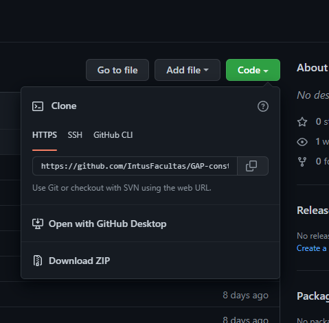
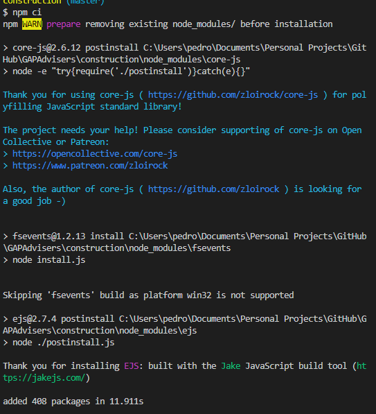
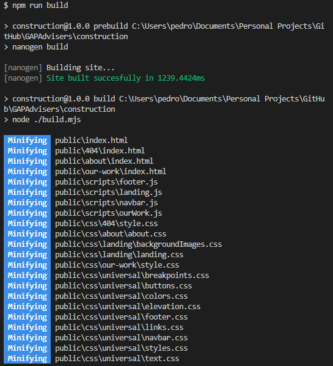
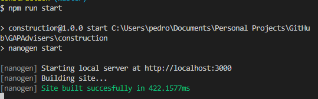
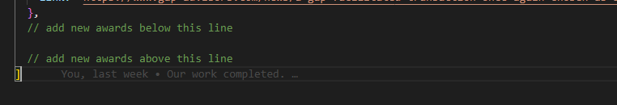
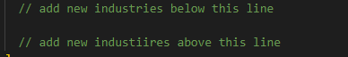
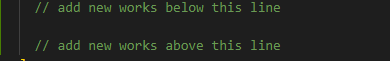

# Setup

In order to create a new version of the website you will need a few specific tools

- NVM (installation link: https://github.com/nvm-sh/nvm#installing-and-updating)
- NodeJS and NPM (installation link: https://docs.npmjs.com/downloading-and-installing-node-js-and-npm)

Once you've installed these tools, download this source code by selecting this option:



and open a terminal like Command Prompt in Windows, or Terminal in MacOS (be sure to run as Administrator).

Navigate to the directory where you've saved the source code (example, if you've saved the file to Downloads, you might run:)

```sh
cd /u/Users/<username>/Downloads/construction
```

and install all the dependencies for the project by running this command in the terminal:

```sh
npm ci
```

You will see the following output: 



Once that is installed, you can run the project or build a new production version.

## Building a production version

Run the command

```sh
npm run build
```



At which point you will see a directory `public/` appear which will contain the minified production code.

## Running the project

Run the command

```sh
npm run start
```



At which point you will have your preferred browser open to the website on `locahost:3000/`

At any point, you can kill the process running the website by pressing `Ctrl + C`

If at any point in time, you want to add new awards, employees, industries, or works, then make the modifications, kill the process, and start the process again.


# Updating Awards

You can update the awards by editing the `awards.js` file in your preferred text editor (don't use Word. Use Windows Notepad, Sublime, VSCode or [Notepad++](https://notepad-plus-plus.org/downloads/))

In the awards file, you will see a list of "objects" that look like following:

```js
{
  year: '2019-2020',
  text: 'ACG Houston Deal of the Year Finalist',
  img: '/images/awards/2020ACG.webp',
  link: 'https://www.gap-advisors.com/news/gap-closing-chosen-as-an-acg-houston-deal-of-the-year-finalist',
},
```

You can delete any of these to remove that entry from the website, or add a new one in the same pattern to add a new award to the website.

The awards will be displayed in the order of the list top to bottom on the website in a left to right top to bottom fashion.

To add a new award, simply copy the format shown above at the end of the list before closing bracket `]`, between the comments indicating as such



An award object contains the following information:

### year

The year copy which is displayed at the top of the copy.

### text

The name of the award.

### img

The link (relative or absolute) to the award image. In the example above, notice that the image for the award (which can be found under `src/assets/images/awards/2020ACG.webp` relative to this file.), the link starts with `/images`.

### link

The link to the award article.

So if you wanted to add an award called "World's best company" from 2022, and had saved an image called "WorldsBestCompany.png" in the awards images folder, you would write:

```js

{
  year: '2022',
  text: "World's best company",
  img: '/images/awards/WorldsBestCompany.png',
  link: 'https://www.gap-advisors.com/news/worlds-best-company',
}
```

**Notice** that each of the copy is surrounded by quotes or double quotes, and notice that each line is finished with a comma.

To learn more about this format, read here: https://www.w3schools.com/js/js_objects.asp

After you have added the new awards, run the **npm run build** command to get the new website production code with the new award.

# Updating Employees

You can update the employees by editing the `employees.js` file in your preferred text editor (don't use Word. Use Windows Notepad, Sublime, VSCode or [Notepad++](https://notepad-plus-plus.org/downloads/))

In the employees file, you will see a list of "objects" that look like following:

```js
{
  firstName: 'Bruce',
  name: 'Bruce Lancaster',
  img: '/images/employees/Bruce Lancaster.webp',
  title: 'Chief Financial Officer',
  link: 'https://www.gap-advisors.com/team/bruce-lancaster'
},
```

You can delete any of these to remove that entry from the website, or add a new one in the same pattern to add a new employee to the website.

The employees will be displayed in the order of the list top to bottom on the website in a left to right top to bottom fashion.

To add a new employee, simply copy the format shown above at the end of the list before closing bracket `]`, between the comments indicating as such


An employee object contains the following information:

### firstName

The first name of the employee (used for the button saying "Get to know `<first name>`")

### name

The name of the employee.

### img

The link (relative or absolute) to the employee image. In the example above, notice that the image for the employee (which can be found under `src/assets/images/employees/Bruce Lancaster.webp` relative to this file.), the link starts with `/images`.


### title

The title of the employee

### link

The link to the employee article.

So if you wanted to add an employee called "John Smith", and had saved an image called "John Smith.png" in the employees images folder, you would write:

```js

{
  firstName: 'John',
  name: "John Smith",
  img: '/images/employees/John Smith.png',
  title: 'New Guy',
  link: 'https://www.gap-advisors.com/team/jojn-smith',
}
```

**Notice** that each of the copy is surrounded by quotes or double quotes, and notice that each line is finished with a comma.

To learn more about this format, read here: https://www.w3schools.com/js/js_objects.asp

After you have added the new employees, run the **npm run build** command to get the new website production code with the new employee.


# Updating Industries

You can update the industries by editing the `industries.js` file in your preferred text editor (don't use Word. Use Windows Notepad, Sublime, VSCode or [Notepad++](https://notepad-plus-plus.org/downloads/))

In the industries file, you will see a list of "objects" that look like following:

```js
{
  text: 'Plumbing',
  img: '/images/industries/plumbing.webp'
},
```

You can delete any of these to remove that entry from the website, or add a new one in the same pattern to add a new industry to the website.

The industries will be displayed in the order of the list top to bottom on the website in a left to right top to bottom fashion.

To add a new industry, simply copy the format shown above at the end of the list before closing bracket `]`, between the comments indicating as such



An industry object contains the following information:


### text

The name of the industry.

### img

The link (relative or absolute) to the industry image. In the example above, notice that the image for the industry (which can be found under `src/assets/images/industries/plumbing.webp` relative to this file.), the link starts with `/images`.

### link

The link to the industry article.

So if you wanted to add an industry called "Fracking", and had saved an image called "Fracking.png" in the industries images folder, you would write:

```js

{
  text: "World's best company",
  img: '/images/industries/Fracking.png',
}
```

**Notice** that each of the copy is surrounded by quotes or double quotes, and notice that each line is finished with a comma.

To learn more about this format, read here: https://www.w3schools.com/js/js_objects.asp

After you have added the new industries, run the **npm run build** command to get the new website production code with the new industry.


# Updating Works

You can update the works by editing the `works.js` file in your preferred text editor (don't use Word. Use Windows Notepad, Sublime, VSCode or [Notepad++](https://notepad-plus-plus.org/downloads/))

In the works file, you will see a list of "objects" that look like following:

```js
{
  year: '2017',
  text: 'C4 Environmental Services acquired by Republic Industrial and Energy Solutions',
  seller: {
    img: '/images/our-work/c4EnvironmentalRepublic/c4EnvironmentalServices.webp',
    companyName: 'C4 Environmental Services',
  },
  buyer: {
    img: '/images/our-work/c4EnvironmentalRepublic/republic.webp',
    companyName: 'Republic Industrial and Energy Solutions'
  },
  link: 'https://www.gap-advisors.com/news/c4-environmental-services-acquired-by-republic-industrial-and-energy-solutions'
},
```

You can delete any of these to remove that entry from the website, or add a new one in the same pattern to add a new work to the website.

The works will be displayed in the order of the list top to bottom on the website in a left to right top to bottom fashion.

To add a new work, simply copy the format shown above at the end of the list before closing bracket `]`, between the comments indicating as such



An work object contains the following information:

### year

The year copy which is displayed at the top of the copy.

### text

The name of the work.

### seller

An object consisting of two attributes:

#### seller.img

The image of the seller's logo.

#### seller.companyName

The company name (used for helping screenreaders identify the logo)

### buyer

An object consisting of two attributes:

#### buyer.img

The image of the buyer's logo.

#### buyer.companyName

The company name (used for helping screenreaders identify the logo)


### link

The link to the work article.

So if you wanted to add an work involving Fox Entertainment being bought by Disney in 2020 you would write

```js
{
  year: '2020',
  text: 'Fox Entertainment acquired by Disney Entertainment',
  seller: {
    img: '/images/our-work/disneyFox/fox.webp',
    companyName: 'Fox Entertainment',
  },
  buyer: {
    img: '/images/our-work/disneyFox/disney.webp',
    companyName: 'Disney Entertainment'
  },
  link: 'https://www.gap-advisors.com/fox-entertainment-acquired-by-disney-entertainment'
},
```

**Notice** that each of the copy is surrounded by quotes or double quotes, and notice that each line is finished with a comma.

To learn more about this format, read here: https://www.w3schools.com/js/js_objects.asp

After you have added the new works, run the **npm run build** command to get the new website production code with the new work.

# Regarding Images.

It's highly recommend that you use `.webp` images, as these are the most performant images for web use. Each additional image will have a performance cost, but you can minimize the performance cost by keeping the images as `.webp` and keeping them appropriately sized for the use case. Industries, Works, Awards are best to be square-ratio images no bigger than `400x400`.